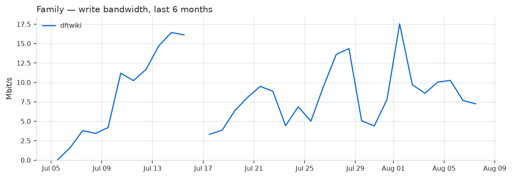
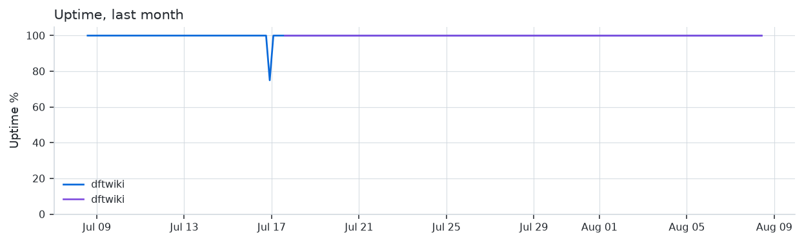
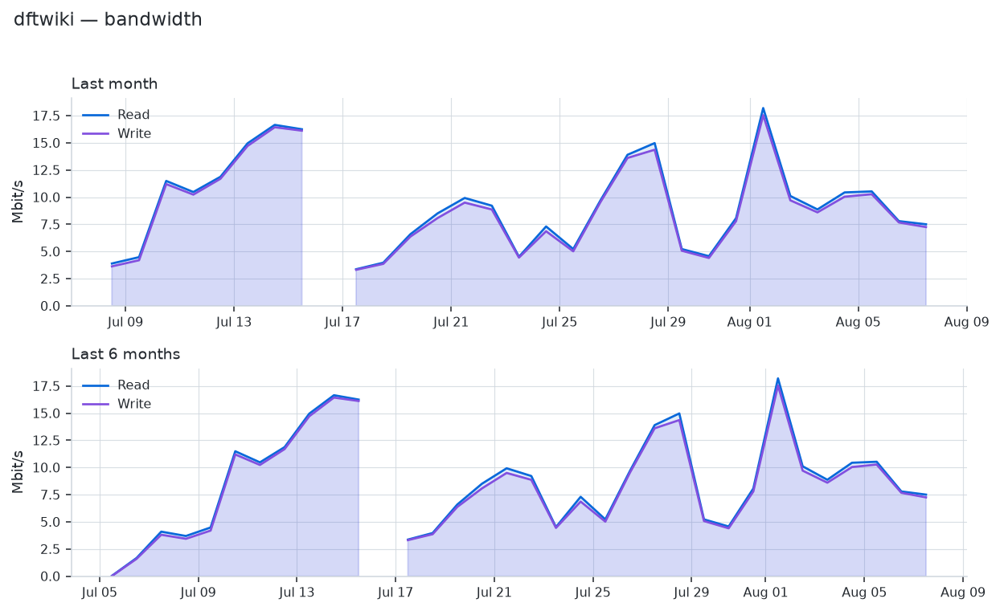
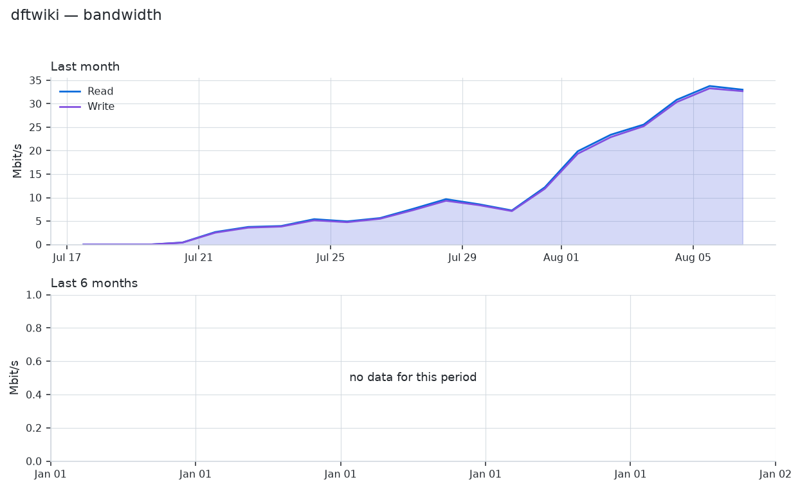

# TOR
Monitoring of my TOR Nodes (Relays)

<!-- RELAY-STATS:START -->
| Relay | Status | Flags | Advertised BW | Consensus weight | Country |
| --- | --- | --- | --- | --- | --- |
| [dftwiki](https://metrics.torproject.org/rs.html#details/BC4736C28F92AA35EF188E84503BFF81F100C325) | 🟢 running | Fast, Running, Stable, Valid | 99.9 Mbit/s | 3,000 | United States of America |
| [dftwiki](https://metrics.torproject.org/rs.html#details/EA11D1FE98637CC0AE1CB3CA2F2638696C6156C8) | 🟢 running | Fast, Running, Stable, Valid | 108.3 Mbit/s | 11,000 | United States of America |

_Last updated: 2026-08-08 13:35 UTC_
<!-- RELAY-STATS:END -->

## Family Overview

<picture>
  <source media="(prefers-color-scheme: dark)" srcset="charts/family-bandwidth-dark.png">
  
</picture>

<picture>
  <source media="(prefers-color-scheme: dark)" srcset="charts/uptime-dark.png">
  
</picture>

## Relay NA

<picture>
  <source media="(prefers-color-scheme: dark)" srcset="charts/BC4736C2-bandwidth-dark.png">
  
</picture>

[View on Relay Search](https://metrics.torproject.org/rs.html#details/BC4736C28F92AA35EF188E84503BFF81F100C325)

## Relay SA

<picture>
  <source media="(prefers-color-scheme: dark)" srcset="charts/EA11D1FE-bandwidth-dark.png">
  
</picture>

[View on Relay Search](https://metrics.torproject.org/rs.html#details/EA11D1FE98637CC0AE1CB3CA2F2638696C6156C8)

